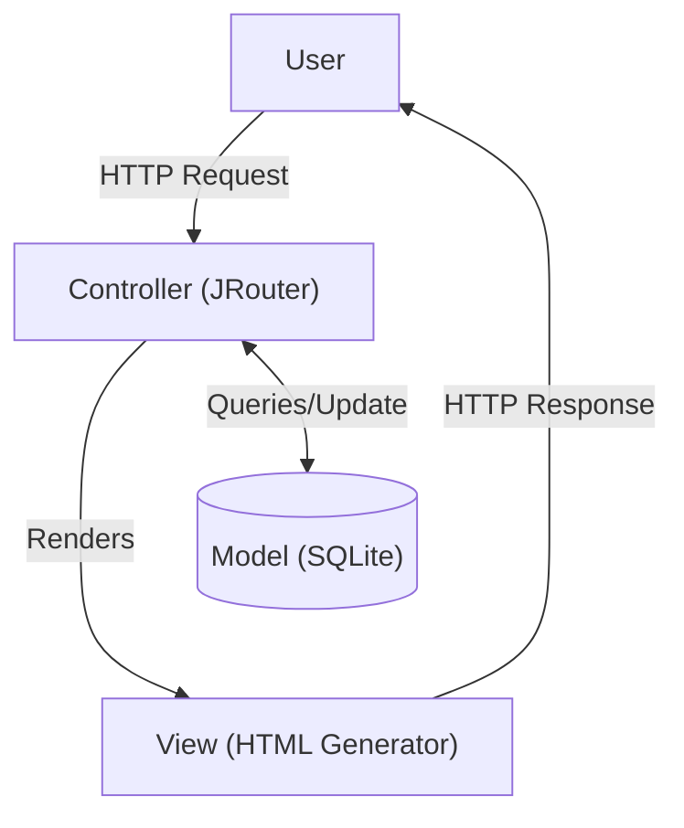

## Overview

Developed a custom web server framework in Java using the Model-View-Controller (MVC) architecture. Utilizing JServer as the foundation, I built a dynamic, stateful book repository application. The framework routes incoming HTTP requests to dedicated Java controllers, managing SQLite database transactions and rendering dynamic HTML views to the client.

### Tech Stack

- **Languages & Frameworks:** Java, HTML, SQL
- **Infrastructure & Deployment:** JServer, Gradle
- **APIs & Integrations:** SQLite



## Challenge

The primary engineering hurdle was converting the relational database definitions into object-oriented Java syntax. Furthermore, the system required maintaining a strict separation of concerns while simultaneously handling three distinct languages (Java, SQL, HTML) within a single request cycle.

### The Solution

- **Strict MVC Architecture:** Separated the application into isolated layers. Built a custom HTTP routing parser to handle incoming requests, a dynamic HTML rendering engine for the View layer, and a dedicated SQL-driven Model layer.
- **Custom ORM Implementation:** Engineered a data-binding layer that automatically mapped raw SQL database entries into manageable Java objects, cleanly abstracting the database queries away from the core business logic.
- **Hardened Security:** Implemented PreparedStatement objects across all database interactions. This enforced strict input sanitization, neutralizing potential SQL injection vulnerabilities and ensuring the database remained secure against malicious queries.

### Code

**Database Queries:**

```java
public static <T> T find(Class<T> c, int id) {
    if (!Model.class.isAssignableFrom(c)) {
        throw new IllegalArgumentException(c.getSimpleName() + " is not a subclass of Model");
    }

    String sql = "SELECT * FROM " + c.getSimpleName() + " WHERE id = ?";

    try (Connection conn = DriverManager.getConnection("jdbc:sqlite:sample.db");
         PreparedStatement pstmt = conn.prepareStatement(sql)) {
        
        pstmt.setInt(1, id);

        try (ResultSet rs = pstmt.executeQuery()) {
            if (rs.next()) {
                T instance = c.getDeclaredConstructor().newInstance();
                Model.class.getDeclaredField("id").set(instance, rs.getInt("id"));

                // Map database columns to @Column annotated fields
                for (Field f : c.getFields()) {
                    if (f.isAnnotationPresent(Column.class)) {
                        Object val = extractValue(rs, f.getType(), f.getName());
                        f.set(instance, val);
                    }
                }
                
                loadHasManyFields(conn, instance);
                return instance;
            }
        }
    } catch (Exception e) {
        throw new RuntimeException("Binding failed for " + c.getSimpleName(), e);  
    }
    return null;
}
```

**Routing Logic:**
```java
public Html route(String verb, String path, Map<String, String> params) {
    // 1. Fail-fast validation
    if (!VERBS.contains(verb)) {
        throw new IllegalArgumentException("Invalid HTTP verb: " + verb);
    }

    // 2. O(1) Route Resolution
    RouteTarget route = routes.get(getKey(verb, path));
    if (route == null) {
        throw new UnsupportedOperationException("Route not found for: " + path);
    }

    try {
        // 3. Dynamic Controller instantiation ensures thread-safe, stateless execution
        Controller controller = (Controller) route.clazz().getDeclaredConstructor().newInstance();
        
        // 4. Invoke the mapped method dynamically via Java Reflection
        return (Html) route.method().invoke(controller, params);
        
    } catch (Exception e) {
        throw new RuntimeException("Routing dispatch failure for " + path, e);
    } 
}
```