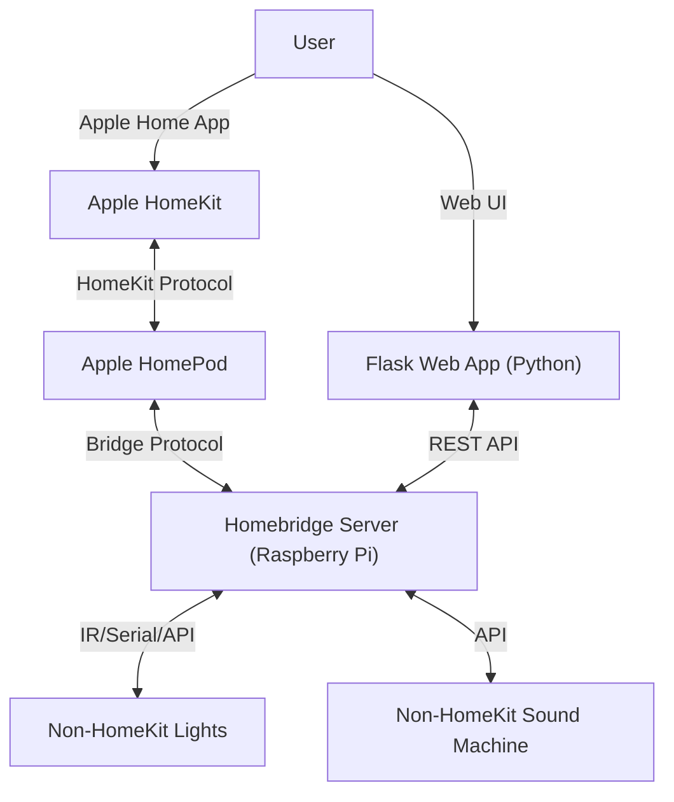

## Overview

Inspired by David Rose’s _Enchanted Objects_, I have been building a locally interconnected environment to enchant various objects around my house. This smart home gives me dynamic, automated control over room conditions, waking routines, and environmental monitoring. The main automation is a gradual, customizable alarm that coordinates connected lights and a sound machine.

### Tech Stack

- **Languages & Frameworks:** Python, Flask, HTML/CSS, JavaScript
- **Infrastructure & Deployment:** Raspberry Pi, Docker, Portainer, GitHub (CI/CD)
- **APIs & Integrations:** Homebridge REST APIs, Apple HomeKit



## Challenge

My first attempts to build a smart home using an Apple HomePod were curtailed by vendor lock-in. I couldn't integrate third-party hardware like IR remotes or soil monitors. Further, adjusting my schedules (such as the early alarms for rowing) required manually editing the configuration settings within the backend application, making it difficult to change quickly and leading to some missed and way too early alarms.

### The Solution

- **System Architecture:** Deployed a local Homebridge server on a Raspberry Pi to act as a bridge between the HomePod and restricted, third-party devices (IR remotes, AC units, sound machines, soil monitors).
- **Custom Interface Development:** Built a lightweight Flask web application that interfaces directly with Homebridge REST APIs, providing a front-end dashboard to easily update and manage my settings dynamically.
- **Containerized Deployment:** Containerized the Flask application using Docker and managed it via Portainer on the Raspberry Pi.
- **Version Control:** Linked the deployment to a GitHub repository, enabling automated updates on the Raspberry Pi whenever new code is pushed to the main branch.

### Flask Server

Homebridge API Client:

```python
class HomebridgeClient:
    """Connects to the Homebridge API to update a switch in Homebridge Dummy plugin"""
    def __init__(self, base_url, username, password):
        self.base_url = base_url.rstrip('/')
        self.username = username
        self.password = password
        self.headers = None
        self.token = None

    def login(self):
        """Authenticates with Swagger API"""
        url = f"{self.base_url}/api/auth/login"
        payload = {"username": self.username, "password": self.password}

        logger.info("Attempting to login %s", url)

        try:
            response = requests.post(url, json=payload, timeout=10)
            response.raise_for_status()

            self.token = response.json().get("access_token")
            self.headers = {"Authorization": f"Bearer {self.token}"}
            logger.info("Login Successful. Token acquired")
            return self.token
        except requests.exceptions.RequestException as e:
            logger.error("Login failed: %s", e)
            return None
```

Alarm Update:
```python
@app.route("/set-alarm-time", methods=["POST"])
def set_alarm_time():
    """Sets the alarm time"""
    data = request.get_json()
    if not data or 'time' not in data:
        return jsonify({"error": "No time provided"}), 400
    
    alarm_time = data.get('time')

    try:
        success = hb_client.update_morning_alarm(alarm_time)
        if success:
            return jsonify({"message": "Homebridge updated"}), 200
        else:
            return jsonify({"error": "Failed to update Homebridge config"}), 500
    except Exception as e:
        return jsonify({"error": f"Internal Server Error: {str(e)}"}), 500
```


