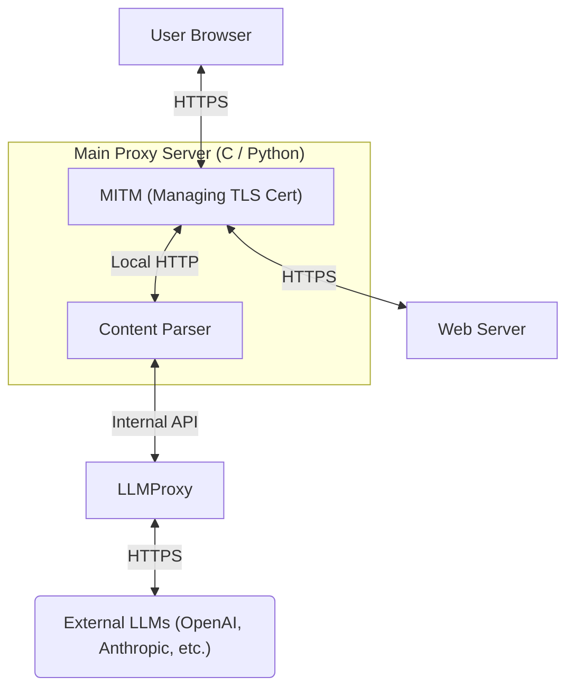

## Overview

Co-developed a custom HTTPS proxy that intercepts web traffic and uses a Large Language Model to edit web page content on the fly. Built using C, Flask, and Beautiful Soup, the initial implementation focused on an automated spoiler-blurring tool for sports scores. However, the underlying architecture is strictly modular, allowing new content-filtering plugins to be easily dropped in.

### Tech Stack

- **Languages & Frameworks:** C, Flask, LLM, Beautiful Soup, Make
- **Infrastructure & Deployment:** GitHub (CI/CD)
- **APIs & Integrations:** LLMProxy API (created by Tufts PhD students)



## Challenge

Building the proxy required a secure Man-in-the-Middle (MITM) architecture that could dynamically manage TLS certificates on the fly. We initially looked at doing everything in C, but quickly realized that native C lacks the robust libraries needed for heavy HTML parsing and LLM API routing. By decoupling the system, we let C handle the high-speed network routing while Python handles the complex text manipulation. Using this architecture we were able to intercept and modify static and semi-static web pages (e.g., Wikipedia, text-heavy blogs). During testing, however, we encountered concurrency bottlenecks when handling heavily dynamic sites generating dozens of asynchronous requests (videos, complex DOMs). To resolve this for future iterations, we discussed a concurrent model utilizing process forking, designing a system to route all asynchronous connections tied to a single session ID through a unified, dedicated proxy instance.

### The Solution

- **Dual-Connection Architecture:** Engineered the C proxy to independently mediate two secure connections: acting as the server to the user's browser, and as the client to the destination web server. The proxy dynamically generated and signed certificates to maintain secure handshakes on both ends.
- **Microservice Offloading:** To bypass C's parsing limitations, we offloaded the text extraction to a secondary Flask microservice.
- **Intelligent DOM Manipulation:** The Flask server utilized BeautifulSoup to strip text elements, passed them to the LLMProxy with specific blurring prompts, and injected the censored content back into the HTML stream before returning it to the proxy.

### Main Proxy

**Python Webpage Parsing:**

```python
@app.route("/", methods=["POST"])
def process_packet():
    """
    Intercepts HTTP packets, identifies spoiler candidates via Regex fast-pass, 
    and verifies context via LLM abstraction layer before mutating the DOM.
    """
    headers, html_body = parse_raw_http(request.data)
    soup = BeautifulSoup(html_body, 'html.parser')

    # 1. Fast-Pass: Regex pre-filtering to avoid high-latency LLM calls
    keyword_re = compile_search_patterns(KEYWORDS)
    candidates = extract_suspicious_nodes(soup, keyword_re)

    if candidates:
        # 2. Verification: Batch query the LLM Proxy to confirm context
        candidate_texts = [item['clean_text'] for item in candidates]
        spoiler_flags = ask_llm(candidates=candidate_texts, query=KEYWORDS)

        # 3. DOM Mutation: Apply CSS blurring to verified spoiler nodes
        for node_data, is_spoiler in zip(candidates, spoiler_flags):
            if is_spoiler:
                target_node = node_data['node']
                target_node["class"] = target_node.get("class", []) + ["spoiler-blur"]

        inject_client_assets(soup) # Appends UI controls & CSS

    return reconstruct_http(headers, str(soup))
```

**SSL Handshake:**
```c
/*
This function creates the necessary SSL contexts (client verification and MITM server),
performs the handshake with the browser (SSL_accept), establishes a connection to the
destination server, and performs the handshake with the destination server (SSL_connect).
All resulting SSL and socket pointers are passed back via arguments.
*/
int perform_ssl_handshakes(int client_sock, const char* host, int port,
                           SSL **client_ssl, SSL **server_ssl,
                           SSL_CTX **client_ctx, SSL_CTX **server_ctx,
                           int *server_sock) {
    *client_ctx = create_client_verification_context();
    *server_ctx = create_server_verification_context(host);

    *client_ssl = SSL_new(*server_ctx);
    SSL_set_fd(*client_ssl, client_sock);
    if (SSL_accept(*client_ssl) <= 0) {
        print_ssl_errors("Error accepting SSL handshake from client");
        return -1; // Indicate failure
    }

    *server_sock = open_client_fd(host, port);
    if (*server_sock < 0) {
        fprintf(stderr, "Error connecting to remote host %s\n", host);
        return -1;
    }

    *server_ssl = SSL_new(*client_ctx);
    SSL_set_fd(*server_ssl, *server_sock);
    SSL_set_tlsext_host_name(*server_ssl, host);

    // Connect to the server from the context
    if (SSL_connect(*server_ssl) <= 0) {
        print_ssl_errors("Error connecting SSL to remote server");
        return -1;
    }

    return 0;
}
```
